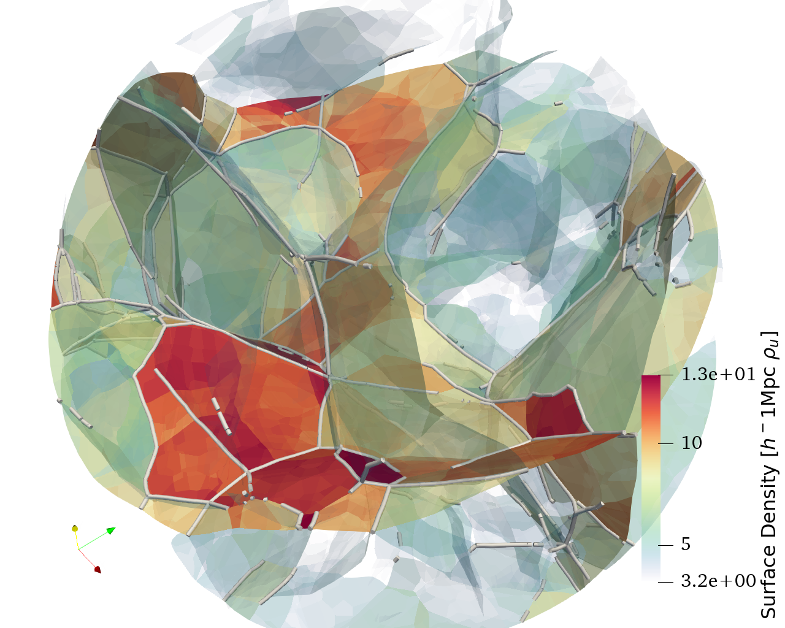

\pagebreak

# Abstract

We present a (relatively) small example of using the CGAL library to run the adhesion model. This literate C++ code reads or generates an initial potential field and computes the *regular triangulation* to that potential, that is a weighted generalisation of the *Delaunay triangulation*. The output is a selection of its dual, the power diagram or weighted Voronoi tessellation, written in a form that is ready for visualisation.

## Version

``` {.cpp #version}
#define VERSION "0.1"
```

\pagebreak

# Introduction

The adhesion model simulates the formation of structure in the Universe on the largest scales. The normal way to do this is to divide matter in the universe into discrete chunks, called particles, and follow their motion and gravitational potential in a lock-step iteration scheme, otherwise known as the N-body simulation.
The adhesion model takes an entirely different approach. It takes as input the initial velocity potential by which particles move, and from that, computes a direct approximation of the geometry of the structures that will form. This geometry is completely specified in terms of voids, walls, filaments and clusters, the structures that together shape the *cosmic web*.
The adhesion model is accurate enough to predict the structures that will form the megaparsec scale of the cosmic web but doesn't reveal the halo structures that are shown in N-body simulations to form inside these structures.

The code presented here computes the adhesion model using the Computational Geometry Algorithm Library (CGAL). The algorithms implemented in this library represent the state-of-the-art of computational geometry, among which is the algorithm to compute the *regular triangulation* of a weighted point set.

This document is aimed to be self-containing. This means that all the code to build a working adhesion model is included. We've tried to limit the involvement of too much boilerplate code by using existing libraries where possible. The main body of the code is covered in three sections. We start with generating initial conditions in the Fourier domain. Then we proceed with the main body of code, implementing the adhesion model on the basis of the algorithms and data structures provided by CGAL. We tie things together in a main executable that reads a configuration file and runs the model. The appendix contains necessary routines for dealing with Fourier transforms, IO and handling of mesh data.



## Prerequisites

From the reader a basic knowledge of programming is required. Familiarity with C/C++ will help to understand the code samples. However, all the code is explained in detail. To run the code the following libraries should be present on the system:

| Package  | version | description |
|----------|---------|-------------|
| C++ compiler | C++17 standard | Tested with GCC 8. |
| GNU Make | - | - |
| CGAL     | ≥4.12   | [The Computational Geometry Algorithm Library](http://cgal.org) |
| XTensor  | ≥0.17   | [XTensor](http://quantstack.net/xtensor) is a template library for handling array data in C++. |
| FFTW3    | ≥3.3    | [The Fastest Fourier Transform in the West](http://www.fftw.org/) |
| hdf5-cpp | ≥1.8.13 | [HDF5](https://support.hdfgroup.org/HDF5/doc/cpplus_RM/index.html) is used to store large blobs of binary data and meta data. |
| yaml-cpp | ≥0.5    | [YAML-cpp](https://github.com/jbeder/yaml-cpp) is a YAML parser for C++. We use it to parse configuration files. |
| argagg   | ≥0.4.6  | [ArgAgg](https://github.com/vietjtnguyen/argagg) stands for Argument Aggregator and is a C++ command-line argument parser. |
| fmt      | ≥4.1    | [fmt](http://fmtlib.net/latest/index.html) is a string formatting library that has a similar interface as Python's. |
| Pandoc   | ≥2.2.3  | [Pandoc](http://pandoc.org/) is a universal document converter. To build this example from the markdown, you need version 2.2.3 or higher and the `pandoc-citeproc` extension. |

All of these packages are available in the Debian GNU/Linux package repositories.

\pagebreak

## Literate programming

This example is written in a style of *literate programming* [@Knuth1984]. This document contains a complete and functioning example of working with CGAL to compute the adhesion model. For didactic reasons we don't always give the listing of an entire source file in one go. In stead, we use a system of references known as *noweb* [@Ramsey1994].

Inside source fragments you may encounter a line with `<<...>>` marks like,

``` {.cpp file=examples/hello_world.cc}
#include <cstdlib>
#include <iostream>

<<example-main-function>>
```

which is then elsewhere specified. Order doesn't matter,

``` {.cpp #hello-world}
std::cout << "Hello, World!" << std::endl;
```

So we can reference the `<<hello-world>>` code block later on.

``` {.cpp #example-main-function}
int main(int argc, char **argv) {
  <<hello-world>>
}
```

A definition can be appended with more code as follows (in this case, order does matter!):

``` {.cpp #hello-world}
return EXIT_SUCCESS;
```

These blocks of code can be *tangled* into source files. The source code presented in this report combine into a fully working example of the adhesion model!

\pagebreak

# Introduction to CGAL

## CGAL Geometry kernels

CGAL comes with a set of *geometry kernels*. Each kernel bundles basic type definitions like `Point`, `Vector`, `Circle`, etc. and geometric operations on those types. Depending on the requirements of the programmer, we can choose different implementations of these concepts. These implementations vary in representation of real numbers, vector quantities, and how geometric operations are computed on them. Some abstract applications require an exact representation of numbers while other more cosmological applications can afford to be more liberal with regards to exactness.

The algorithms that actually do the advanced geometric computations, like the regular triangulations we use, are implemented in generic terms using C++ template techniques. We need to supply those algorithms the correct geometry kernel for our application. This is why all CGAL programs start with a list of template type definitions.

In our case, what we need is a double precision floating point representation of numbers, while retaining logical consistency in geometric predicates, of which the co-linearity test is the most obvious example. This is provided by the `Exact_predicates_inexact_constructions_kernel` kernel.

We collect those type definitions in a separate header file:

``` {.cpp file=src/cgal_base.hh}
#pragma once
#include <CGAL/Exact_predicates_inexact_constructions_kernel.h>
#include <CGAL/Regular_triangulation_3.h>

typedef CGAL::Exact_predicates_inexact_constructions_kernel K;
typedef CGAL::Regular_triangulation_3<K>                    RT;

typedef K::Vector_3           Vector;
typedef K::Point_3            Point;
typedef RT::Edge              Edge;
typedef RT::Weighted_point    Weighted_point;
typedef RT::Segment           Segment;
typedef RT::Tetrahedron       Tetrahedron;
```

Since we'll be using bare (weightless) points, weighted points, and vectors we defined aliases for those types. Note that CGAL is particular about the difference between points and vectors. Points are locations without absolute properties, whereas vectors describe how to get from one point to the other. Internally they can have the same numerical representation, but this may not strictly be the case for all geometry kernels.

# Initial conditions

The initial conditions are randomly generated on a grid. We suppose a platonic ideal Gaussian random field that underlies our realisation. This is a function that is only defined in probabalistic terms. In cosmology it comes natural that these probabalities do not depend on location. For example, in the case of completely uncorrelated Gaussian white noise, we can ask: what is the probability that this function attains a certain value,

$$P(f(x) = y) = \frac{1}{\sqrt{2\pi \sigma^2}} \exp \left(-\frac{(y - \mu)^2}{2 \sigma^2}\right).$$

We're looking at quantities, like the density perturbation, that have mean $\mu = 0$. When we generate white noise, we're sampling a realisation of such a function $f$ at a limited set of points. This should be considered in contrast with seeing a realisation as as integral quantities to a grid cell. Any integral of a white noise over a finite area results exactly in the mean value.

To get an instance of a physically meaningful field, with non-zero integrals, requires that the values of the function $f$ are positively correlated at the small scale. Taking any two positions $x_1$ and $x_2$, their correlation is

$$\xi(x_1, x_2) = \langle f(x_1) f(x_2) \rangle.$$

Often we write the correlation function $\xi(r)$ because our fields are isotropic and homogeneous. We can now ask the next question: what is the probability that the function $f$ at position $\vec{x}$ attains the value $f(\vec{x}) = y_1$ and at position $\vec{x} + \vec{r}$ attains the value $f(\vec{x} + \vec{r}) = y_2$,

$$P(f(\vec{x}) = y_1, f(\vec{x} + \vec{r}) = y_2) = \frac{1}{\sqrt{2\pi |\Sigma(r)|}} \exp \left(-\frac{1}{2} \begin{pmatrix}y_1\\y_2\end{pmatrix}^T \Sigma^{-1}(r) \begin{pmatrix}y_1\\y_2\end{pmatrix}\right).$$

Here, $\Sigma(r)$ is the corellation matrix,

$$\Sigma(r) = \begin{pmatrix}\sigma^2 & \xi(r)\\\xi(r) & \sigma^2\end{pmatrix},$$

``` {.cpp file=src/initial_conditions.hh}
#pragma once
#include "boxparam.hh"

#include <memory>
#include <xtensor/xtensor.hpp>
#include <yaml-cpp/yaml.h>

extern std::unique_ptr<xt::xtensor<double, 3>>
generate_white_noise(
    BoxParam const &box,
    unsigned long seed);

<<power-spectra>>

extern void compute_potential(
    BoxParam const &box,
    xt::xtensor<double, 3> &white_noise,
    PowerSpectrum const &P);
```

## The simulation box

Next, we need to define the box that we will use. We collect the required parameters, box size in pixels and the physical length, in a structure called `BoxParam`.

``` {.cpp file=src/boxparam.hh}
#pragma once
#include <cstdlib>
#include <cmath>
#include <array>

<<increment-index>>

template <typename T>
inline T sqr(T x) { return x*x; }

struct BoxParam {
  unsigned N;         // number of grid points in a row
  size_t   size;      // number of points in the entire box
  double   L;         // physical size of the box
  double   res;       // resolution of the box
  double   res_sqr;   // square of the resolution

  BoxParam(unsigned N_, double L_)
    : N(N_)
    , size(N*N*N)
    , L(L_)
    , res(L/N)
    , res_sqr(res*res)
  {}

  std::array<size_t, 3> shape() const
  {
    return std::array<size_t, 3>{ N, N, N };
  }

  <<fourier-properties>>

  <<boxparam-methods>>
};
```

We add a method to compute the $n$-th point on a grid.

``` {.cpp #boxparam-methods}
template <typename Point>
Point point(size_t i) const
{
  int x = i % N;
  int y = (i / N) % N;
  int z = i / (N * N);

  return Point(x * res, y * res, z * res);
}
```

Note that we set the $x$-coordinate to be the fastest changing coordinate in the flattened array. This is known as *row-major* ordering, which the same as how indexing into C/C++ and Python/NumPy arrays works. Later on, we will be adding more methods to the `BoxParam` structure.

### Fourier properties

These functions we'll need when we compute Fourier transforms. The real FFT algorithm saves precious memory by using only half the space of the complex FFT. With the exception of the Nyquist frequencies that makes $N/2 + 1$ for the last axis.

``` {.cpp #fourier-properties append=true}
std::array<size_t, 3> rfft_shape() const {
  return std::array<size_t, 3>{ N, N, N/2 + 1 };
}

size_t rfft_size() const {
  return N * N * (N / 2 + 1);
}
```

Next up, we need to compute the wave number of the Fourier mode represented at a certain index. With a physical box-size of $L$ and a logical size of $N$, we use the following convention

$$k_i = i \frac{2 \pi}{L},~{\rm for}~i \in [0, 1, \dots, N/2, -N/2 - 1, \dots, -1].$$

``` {.cpp #fourier-properties append=true}
double wave_number(int i) const {
  return ( int(i) > int(N)/2
         ? int(i) - int(N)
         : int(i) ) * (2*M_PI)/L;
}

double k_abs(std::array<size_t, 3> const &loc) const {
  double x = 0.0;
  for (size_t i : loc)
    x += sqr(wave_number(i));
  return sqrt(x);
}
```

### Iterating multi-dimensional arrays

We'll be indexing multi-dimensional arrays. To prevent having to write nested for-loops, we use the `increment_index` helper function.

``` {.cpp #increment-index}
template <unsigned R>
inline unsigned increment_index(
    std::array<size_t, R> const &shape,
    std::array<size_t, R> &index)
{
  for (unsigned i = 0; i < R; ++i) {
    unsigned k = R - i - 1;
    if (++index[k] < shape[k])
      return k;

    index[k] = 0;
  }

  return R;
}
```

## White noise

The `white_noise` function fills a newly created array with random values, following a normal distribution with $\sigma = 1$.

``` {.cpp file=src/white_noise.cc}
#include "initial_conditions.hh"
#include <random>

std::unique_ptr<xt::xtensor<double, 3>>
generate_white_noise(
    BoxParam const &box, unsigned long seed)
{
  auto result = std::make_unique<xt::xtensor<double, 3>>(box.shape());

  std::mt19937 random(seed);
  std::normal_distribution<double> normal;

  for (double &value : *result) {
    value = normal(random);
  }

  return result;
}
```

## Power spectrum

A power spectrum is a function taking in a value of $k$ in units of $h {\rm Mpc}^{-1}$ giving an amplitude.

``` {.cpp #power-spectra}
using PowerSpectrum = std::function<double (double)>;
using Config = YAML::Node;

extern PowerSpectrum EisensteinHu(
    Config const &cosmology);

extern PowerSpectrum normalize_power_spectrum(
    BoxParam const &box,
    PowerSpectrum const &P,
    Config const &cosmology);
```

### Eisenstein-Hu power spectrum

The power spectrum for CDM is given by an almost scale-free spectrum modified by a *transfer function* $T_0$ which embodies post-inflation physics.

$$P(k) = A k^{n_s} T_0^2(k)$$

To compute $T_0$ from the Boltzmann equation there exists a code called CMBfast, but most often people use a fitting function. Eisenstein & Hu (1997) give the following fitting formula for the CDM transfer function:

$$\begin{aligned}
T_0(q) &=& \frac{L_0}{L_0 + C_0 q^2}\\
L_0(q) &=& \log(2 e + 1.8 q)\\
C_0(q) &=& 14.2 + \frac{731}{1 + 62.5 q},
\end{aligned}$$

where $q$ is the wave number re-scaled to find the *knee* in the CDM power spectrum.

$$q = \frac{k}{h {\rm Mpc}^{-1}} \Theta_{2.7}^2 / \Gamma,$$

where $\Theta_{2.7}$ is the temperature of the CMB divided by 2.7 and $\Gamma = \Omega_0 h$.

``` {.cpp file=src/eisenstein-hu.cc}
#include "initial_conditions.hh"

PowerSpectrum EisensteinHu(Config const &cosmology)
{
  double const
    e         = exp(1),
    Theta_CMB = 2.7255/2.7,
    Omega0    = cosmology["Omega0"].as<double>(),
    h         = cosmology["h"].as<double>(),
    ns        = cosmology["ns"].as<double>();

  return [=] (double k)
  {
    double q  = k * pow(Theta_CMB, 2)/(Omega0 * h),
           L0 = log(2*e + 1.8*q),
           C0 = 14.2 + 731.0/(1 + 62.5*q),
           T0 = L0 / (L0 + C0 * pow(q, 2));

    return pow(k, ns) * pow(T0, 2);
  };
}
```

### Normalisation

``` {.cpp file=src/normalize_power_spectrum.cc}
#include "initial_conditions.hh"
#include <gsl/gsl_integration.h>

inline double W_th(double y)
{
  return 3.0 / pow(y, 3) * (sin(y) - y * cos(y));
}

double integration_helper(double x, void *params)
{
  auto f = reinterpret_cast<std::function<double (double)> *>(params);
  return (*f)(x);
}

PowerSpectrum normalize_power_spectrum(
    BoxParam const &box,
    PowerSpectrum const &P,
    Config const &cosmology)
{
  size_t limit = 1024;
  double k_lower = 2 * M_PI / box.L;
  double epsabs = 1e-6, epsrel = 1e-6;
  double x, abserr;
  double sigma8 = cosmology["sigma8"].as<double>();

  gsl_integration_workspace *workspace =
    gsl_integration_workspace_alloc(limit);

  std::function<double (double)> integrant = [&] (double k)
  {
    return P(k) / (2 * M_PI*M_PI) * pow(W_th(8.0 * k) * k, 2);
  };

  gsl_function f;
  f.function = &integration_helper;
  f.params = reinterpret_cast<void *>(&integrant);

  gsl_integration_qagiu(
    &f, k_lower, epsabs, epsrel, limit,
    workspace, &x, &abserr);
  double A = sigma8 / sqrt(x);

  gsl_integration_workspace_free(workspace);

  return [=] (double k) {
    return A * P(k);
  };
}
```

## Applying the power spectrum

We now apply the desired power spectrum to the previously generated white noise. This is done by transforming the white noise to the Fourier domain, multiplying it by the square root of the power spectrum, and then transforming back again.

``` {.cpp file=src/apply_power_spectrum.cc}
#include "initial_conditions.hh"
#include "fft.hh"

void compute_potential(
    BoxParam const &box,
    xt::xtensor<double, 3> &field,
    PowerSpectrum const &P)
{
  RFFT3 rfft(box);
  auto f_shape = box.rfft_shape();

  std::copy(field.begin(), field.end(), rfft.real_space.begin());
  rfft.forward_transform();

  std::array<size_t, 3> loc = {0, 0, 1};
  double V = pow(box.L / box.N, 3.0);
  for (size_t i = 1; i < box.rfft_size(); ++i) {
    double k = box.k_abs(loc);
    rfft.fourier_space[i] *= sqrt(P(k)) / (V * k * k);
    increment_index<3>(f_shape, loc);
  }

  rfft.backward_transform();
  std::copy(rfft.real_space.begin(), rfft.real_space.end(), field.begin());
}
```

\pagebreak

# The Adhesion model

We're solving the inviscid Burgers equation,
$$\partial_t \vec{v} + (\vec{v} \cdot \vec{\nabla}) \vec{v} = \nu \nabla^2 \vec{v},$$
in the limit of $\nu \to 0$. @Hopf1950 gave the solution to this equation. This solution is given by maximising the function
$$G(\vec{q}, \vec{x}, t) = \Phi_0(\vec{q}) - \frac{(\vec{x} - \vec{q})^2}{2t},$$
to obtain the Eulerian velocity potential
$$\Phi(\vec{x}, t) = \max_q G(\vec{q}, \vec{x}, t).$$
This solution can be computed through the power diagram, given a set of points $S \subset \mathbb{R}^n$, and a weight $w_u$ associated with each point $\vec{u} \in S$, the *power cell* is defined as,
$$V_u = \left\{\vec{x} \in \mathbb{R}^n \big| (\vec{x} - \vec{u})^2 + w_u \le (\vec{x} - \vec{v})^2 + w_v\ \forall \vec{v} \in S\right\}.$$
Setting the weights to,
$$w(\vec{q}) = 2 t \Phi_0(\vec{q}),$$
the adhesion model uses regular triangulations to compute structures directly from the initial conditions.

``` {.cpp file=src/adhesion.hh}
#pragma once
#include "boxparam.hh"
#include "cgal_base.hh"
#include "mesh.hh"
#include <memory>
#include <array>
#include <cstdint>
#include <H5Cpp.h>

class Adhesion
{
  RT                          rt;
  std::vector<Weighted_point> vertices;
  double                      time;

public:
  <<adhesion-node-type>>
  <<adhesion-node-struct>>
  <<adhesion-constructor>>

  int edge_count(RT::Cell_handle h, double threshold) const;
  Vector velocity(RT::Cell_handle c) const;

  Mesh<Point, double> get_walls(double threshold) const;
  Mesh<Point, double> get_filaments(double threshold) const;
  std::vector<Node> get_nodes(double threshold) const;
};
```

## Computing the triangulation

We give each point in the grid a weight proportional to the velocity potential,
$$w_i = 2 t \Phi(q_i).$$
Then we insert these weighted points into the triangulation.

``` {.cpp #adhesion-constructor}
template <typename Array>
Adhesion(BoxParam const &box, Array &&potential, double t)
  : time(t)
{
  for (size_t i = 0; i < box.size; ++i)
  {
    vertices.emplace_back(
      box.point<Point>(i),
      potential[i] * 2 * time);
  }

  rt.insert(
    vertices.begin(),
    vertices.end());
}
```

## Node properties

Any node in the power diagram can be of the type *void*, *kurtoparabolic*, *wall*, *filament*, *cluster* or *undefined*. This last category is a catch-all that really shouldn't happen.

A *kurtoparabolic* [@Frisch2001] is a point where a wall ends in a void. In the Zeldovich approximation we would see a cusp here, so the kurtoparabolic points are equivalent to $A_3$ singularities in Arnold's ADE classification [@Arnold1982,@Hidding2014].

``` {.cpp #adhesion-node-type}
enum NodeType : uint32_t {
  VOID, KURTOPARABOLIC, WALL, FILAMENT, CLUSTER, UNDEFINED_NODE_TYPE
};
```

Other properties that we can ascribe to a node are its *position*, *velocity* and *mass*.

``` {.cpp #adhesion-node-struct}
struct Node {
  std::array<double, 3> position;
  std::array<double, 3> velocity;
  double    mass;
  NodeType  node_type;
};
```

Note that the masses of any cell other then the cluster cells carry no physical meaning, unless corrected for the resolution of the box. If we double the resolution, the average mass of a void particle drops by a factor eight, the average mass of a wall particle by a factor four, and the average mass of a filament particle by a factor two. Also we know that the total mass is conserved.

## Filtering for structures

When we want to select filaments or clusters we need to count how many edges of a certain cell in the regular triangulation exceeds a given threshold. The function `Adhesion::edge_count` takes a cell handle and a threshold and returns the number of long edges. This count determines if the cell is part of a void, wall, filament or node.

| edge count | structure |
|-----------:|-----------|
|          0 | void      |
|      1 - 2 | kurtoparabolic point |
|      3 - 4 | wall      |
|          5 | filament  |
|          6 | node      |

This table translates to the following helper function:

``` {.cpp #adhesion-type-from-edge-count}
inline Adhesion::NodeType type_from_edge_count(int n)
{
  switch (n) {
    case 0: return Adhesion::VOID;
    case 1:
    case 2: return Adhesion::KURTOPARABOLIC;
    case 3:
    case 4: return Adhesion::WALL;
    case 5: return Adhesion::FILAMENT;
    case 6: return Adhesion::CLUSTER;
  }
  return Adhesion::UNDEFINED_NODE_TYPE;
}
```

### Counting edges

We count the number of edges that are incident to the cell `h` and exceed the distance squared `threshould`.

``` {.cpp file=src/adhesion_edge_count.cc}
#include "adhesion.hh"

int Adhesion::edge_count(RT::Cell_handle h, double threshold) const
{
  int count = 0;
  for (unsigned i = 1; i < 4; ++i) {
    for (unsigned j = 0; j < i; ++j) {
      auto segment = rt.segment(h, i, j);
      double l = segment.squared_length();

      if (l > threshold) {
        ++count;
      }
    }
  }
  return count;
}
```

## Counting equivalent groups

Another way to detect the type of a node is by counting the number of groups in the vertices of a cell in the regular triangulation, going by an equivalence relation between the vertices based on their connectivity in the non-weighted Delaunay triangulation.

``` {.cpp #adhesion-vertex-equivalence}
// NYI
```

## Velocity

To compute the velocity of a particle (a node in the power diagram), we need to compute the gradient of the velocity potential over the corresponding cell in the regular triangulation. We can use CGAL here to do the hard work for us. The d-dimensional geometry kernel lets us compute the hyperplane associated with the four vertices of the cell in the triangulation.

``` {.cpp file=src/adhesion_velocity.cc}
#include "adhesion.hh"
#include <limits>
#include <CGAL/Cartesian_d.h>
#include <CGAL/Kernel_d/Hyperplane_d.h>

typedef CGAL::Cartesian_d<double>    LiftedK;
typedef CGAL::Point_d<LiftedK>       LiftedPoint;
typedef CGAL::Hyperplane_d<LiftedK>  HyperPlane;

<<velocity-define-infinity>>

<<velocity-lifted-point>>

Vector Adhesion::velocity(RT::Cell_handle c) const {
  <<velocity-implementation>>
}
```

We'll need a point at infinity to give the hyperplane an orientation.

``` {.cpp #velocity-define-infinity}
constexpr double infinity
  = std::numeric_limits<double>::infinity();
```

CGAL's d-dimensional kernel needs to be told how many coordinates there are in a point, so we write a little wrapper.

``` {.cpp #velocity-lifted-point}
inline LiftedPoint lifted_point(
    double x, double y, double z, double w)
{
  double p[4] = { x, y, z, w };
  return LiftedPoint(4, p, p + 4);
}
```

We first need to convert the cell handle to its four lifted points.

``` {.cpp #velocity-implementation}
LiftedPoint points[4];

for (unsigned i = 0; i < 4; ++i)
{
  Weighted_point wp = rt.point(c, i);
  auto p = wp.point();
  auto w = wp.weight();
  points[i] = lifted_point(p.x(), p.y(), p.z(), w);
}
```

Then we create the hyperplane associated with these points, taking care to have the orientation such that the normal is pointing in positive `w` direction. This is done by having the guide point $(0, 0, 0, -\infty)$ on the negative side of the hyperplane.

``` {.cpp #velocity-implementation}
auto guide = lifted_point(0, 0, 0, -infinity);
HyperPlane h(points, points + 4, guide, CGAL::ON_NEGATIVE_SIDE);
```

Given the normal $\vec{n}$, the velocity vector is given by
$$v_i = \frac{n_i}{2 t n_w},$$
where $i$ indexes the $x$, $y$ and $z$ components.

``` {.cpp #velocity-implementation}
auto normal = h.orthogonal_vector();
auto v  = normal / (2 * time * normal[3]);

return Vector(v[0], v[1], v[2]);
```

## Getting all nodes

We will retrieve the position, mass, velocity and node type of each dual vertex in the regular triangulation.

``` {.cpp file=src/adhesion_get_nodes.cc}
#include "adhesion.hh"

<<adhesion-type-from-edge-count>>

std::vector<Adhesion::Node>
Adhesion::get_nodes(double threshold) const
{
  std::vector<Adhesion::Node> result;

  for (auto c  = rt.finite_cells_begin();
            c != rt.finite_cells_end();
            ++c) {
    std::array<double, 3>  ps, vs;
    Point    p = rt.dual(c);
    Vector   v = velocity(c);
    for (unsigned i = 0; i < 3; ++i) {
      ps[i] = p[i];
      vs[i] = v[i];
    }
    NodeType n = type_from_edge_count(
                   edge_count(c, threshold));
    double   m = rt.tetrahedron(c).volume();

    result.push_back(Adhesion::Node({ps, vs, m, n}));
  }

  return result;
}
```

## The power diagram

The power diagram is the dual of the regular triangulation. CGAL supports saving the power diagram directly as an OFF file, or alternatively to send information to GeomView. For our purpose these options are not good enough. Our goal is to make a picture of the structures. For this we need to filter out any structures below a certain threshold. Then we want to store the density of the walls along with the faces and the density of filaments along with the edges.

In this case we'll store them as Wavefront OBJ files. This is a text based file format, so we can't store too large amounts of data. However, it is well supported by most visualisation toolkits and has the option to store a little bit of extra data in the texture coordinates. Texture coordinates are normally used to map images onto 3D surfaces, hence they have two dimensions, $u$ and $v$. We'll only use the $u$ coordinate to store the density of the walls. The procedure for saving OBJ files is given in the [Appendix](#obj-file-format).

We'll define the function that computes the duals of the regular triangulation and stores it in a structure we call `Mesh<Point, double>`.

``` {.cpp file=src/power_diagram.hh}
#include "cgal_base.hh"
#include "mesh.hh"

extern Mesh<Point, double> power_diagram_faces(
  RT const &rt, double threshold);

extern Mesh<Point, double> power_diagram_edges(
  RT const &rt, double threshold);
```

### The `Mesh` data structure

The `Mesh` structure contains a vector of points `vertices` and a vector of vector of unsigned integers `polygons` indexing into the `vertices` vector. We have decorated each polygon in the `polygons` vector with a value of type `double` to give the surface density of that polygon, hence `Mesh<Point, double>`.

``` {.cpp #mesh-definition}
template <typename Point, typename Info>
struct Mesh
{
  std::vector<Point>    vertices;
  std::vector<unsigned> data;
  std::vector<unsigned> sizes;
  std::vector<Info>     info;

  <<mesh-methods>>
};
```

The `Mesh` structure and `Decorated` helper class are defined in the `mesh.hh` header file.

### Obtaining duals

The implementation of `power_diagram_faces` loops over all edges in the regular triangulation.

``` {.cpp #pd-walls-loop}
for (auto e = rt.finite_edges_begin();
      e != rt.finite_edges_end();
      ++e)
{
  <<pd-edge-check>>
  <<pd-collect-dual>>
  <<pd-add-to-mesh>>
}
```

In each iteration, we check if the edge is significant.

``` {.cpp #pd-edge-check}
if (is_big_edge(rt, *e, threshold)) {
  continue;
}
```

Next we extract the power diagram vertices of the wall by looping over all *incident cells* of the edge. We need to take care not to include the infinite cell that represents everything outside the triangulation. Because the iteration of the incident cells is circular we cannot use a normal for-loop.

``` {.cpp #pd-collect-dual}
std::vector<unsigned> polygon;
auto first = rt.incident_cells(*e), c = first;
bool ok = true;

do {
  if (rt.is_infinite(++c)) {
      ok = false;
      break;
  }

  polygon.push_back(get_dual_vertex(c));
} while (c != first);
```

When all dual vertices have been added to the mesh (and the infinite cell was not encountered) we can add the resulting polygon to the mesh.

``` {.cpp #pd-add-to-mesh}
if (ok) {
  double l = sqrt(rt.segment(*e).squared_length());
  mesh.push_back(polygon, l);
}
```

#### Dual vertex

Every cell in the regular triangulation is associated with a vertex in the power diagram. We write a small helper function that obtains this dual vertex and caches it in a map.

``` {.cpp #pd-dual-vertex}
std::map<RT::Cell_handle, unsigned> cell_index;

auto get_dual_vertex = [&rt, &cell_index, &mesh] (
    RT::Cell_handle const &h) -> unsigned
{
  if (cell_index.count(h) == 0)
  {
    cell_index[h] = mesh.vertices.size();
    mesh.vertices.push_back(rt.dual(h));
  }

  return cell_index[h];
};
```

### Testing significance

We do not want to get the dual of all edges in the regular triangulation. Only those edges that exceed a given length are 'physical' objects. We check if the squared length of the edge `e` is larger than the given threshold:

``` {.cpp #pd-is-big-edge}
inline bool is_big_edge(RT const &rt, RT::Edge const &e, double threshold)
{
  double l = rt.segment(e).squared_length();
  return l < threshold;
}
```

For filaments this procedure is slightly more involved. A filament is the dual of a regular facet. The facet is encoded as a cell (one of the co-faces of the facet) and the vertex of that cell that is opposite the facet. We need to check the lengths of all the edges of the facet, so we need to iterate all combinations of vertices of the co-face not containing the given opposite vertex.

``` {.cpp #pd-is-big-facet}
inline bool is_big_facet(RT const &rt, RT::Facet const &f, double threshold)
{
  RT::Cell_handle c = f.first;
  unsigned        k = f.second;

  for (unsigned i = 0; i < 4; ++i) {
    if (i == k) {
      continue;
    }

    for (unsigned j = 0; j < i; ++j) {
      if (j == k) {
        continue;
      }

      if (rt.segment(c, i, j).squared_length() < threshold) {
        return false;
      }
    }
  }

  return true;
}
```

### Function body (walls)

Collecting these steps, the rest of the implementation of `power_diagram_faces` is as follows:

``` {.cpp file=src/power_diagram/faces.cc}
#include "power_diagram.hh"

<<pd-is-big-edge>>

Mesh<Point, double> power_diagram_faces(
  RT const &rt,
  double threshold)
{
  Mesh<Point, double> mesh;
  <<pd-dual-vertex>>
  <<pd-walls-loop>>
  return mesh;
}
```

### Filaments

The implementation for the filaments is very similar. In the case of a facet in the regular triangulation, we only need to compute the dual of the two co-faces of the facet. Again, in CGAL the facet is represented as one of the two co-faces and the vertex opposite the facet. This means there are two 'mirror' representations of the same facet. To get the other co-facet we can query the triangulation for the mirror facet.

``` {.cpp file=src/power_diagram/edges.cc}
#include "power_diagram.hh"

<<pd-is-big-facet>>

Mesh<Point, double> power_diagram_edges(
  RT const &rt,
  double threshold)
{
  Mesh<Point, double> mesh;
  <<pd-dual-vertex>>

  for (auto f = rt.finite_facets_begin();
       f != rt.finite_facets_end();
       ++f)
  {
    if (!is_big_facet(rt, *f, threshold)) {
      continue;
    }

    double area = sqrt(rt.triangle(*f).squared_area());
    auto mirror = rt.mirror_facet(*f);

    if (rt.is_infinite(f->first) || rt.is_infinite(mirror.first)) {
      continue;
    }

    std::vector<unsigned> polygon;
    polygon.push_back(get_dual_vertex(f->first));
    polygon.push_back(get_dual_vertex(mirror.first));
    mesh.push_back(polygon, area);
  }

  return mesh;
}
```

### Retrieving the walls

We think it is important to make the step from abstract mathematics to physical model explicit. The implementation of the `get_walls` method is now trivial though.

``` {.cpp file=src/adhesion_get_walls.cc}
#include "adhesion.hh"
#include "power_diagram.hh"

Mesh<Point, double> Adhesion::get_walls(
    double threshold) const
{
  return power_diagram_faces(rt, threshold);
}

Mesh<Point, double> Adhesion::get_filaments(
    double threshold) const
{
  return power_diagram_edges(rt, threshold);
}
```

\pagebreak

# The main program

We're now ready to write the main program. It will read a configuration file from file and compute the adhesion model accordingly.

## Configuration

We read the configuration from a YAML file. Let's take the latest values from the Planck collaboration.

``` {.yaml #default-config file=examples/lcdm.yaml}
box:
  N:      128      # logical box size
  L:      32.0     # physical box size

cosmology:
  power-spectrum: Eisenstein & Hu
  h:        0.674   # Hubble parameter / 100
  ns:       0.965   # primordial power spectrum index
  Omega0:   1.0     # density in units of critical density
  sigma8:   0.811   # amplitude over 8 Mpc/h

run:
  seed:     8
  time:     [1.0, 2.0, 3.0]

output:
  hdf5:            output/lcdm.h5
  walls:           output/lcdm-{time:02.1f}-walls.obj
  filaments:       output/lcdm-{time:02.1f}-filaments.obj
  threshold:       10.0
```

## Run function

``` {.cpp file=src/run.hh}
#pragma once
#include <yaml-cpp/yaml.h>
#include <fmt/format.h>

extern void run(YAML::Node const &config);
```

``` {.cpp file=src/run.cc}
#include <iostream>
#include <fstream>
#include <exception>
#include <H5Cpp.h>

#include "run.hh"
#include "initial_conditions.hh"
#include "adhesion.hh"
#include "sphere.hh"
#include "writers.hh"
#include "write_obj.hh"

void run(YAML::Node const &config)
{
  <<workflow>>
}
```

### Create box

``` {.cpp #workflow}
std::cerr << "Using box with parameters:\n"
          << config["box"] << "\n";
BoxParam box(
  config["box"]["N"].as<int>(),
  config["box"]["L"].as<double>());
```

### Generate initial conditions

``` {.cpp #workflow}
std::cerr << "Generating initial conditions:\n"
          << config["cosmology"] << "\n";
auto seed = config["run"]["seed"].as<unsigned long>();
auto field = generate_white_noise(box, seed);
auto cosmology = config["cosmology"];
auto power_spectrum = normalize_power_spectrum(
  box, EisensteinHu(cosmology), cosmology);
compute_potential(box, *field, power_spectrum);
```

### Write initial conditions to file

``` {.cpp #workflow}
std::string output_filename = config["output"]["hdf5"].as<std::string>();
H5::H5File file(output_filename, H5F_ACC_TRUNC);
std::array<hsize_t, 3> shape = { box.N, box.N, box.N };
H5::DataSpace dataspace(3, shape.data());
H5::FloatType datatype(H5::PredType::NATIVE_DOUBLE);
H5::DataSet dataset = file.createDataSet("potential", datatype, dataspace);
dataset.write(field->data(), H5::PredType::NATIVE_DOUBLE);
```

### Compute adhesion model

``` {.cpp #workflow}
std::vector<double> time;
auto time_cfg = config["run"]["time"];
switch (time_cfg.Type()) {
  case YAML::NodeType::Scalar:
    time.push_back(time_cfg.as<double>());
    break;
  case YAML::NodeType::Sequence:
    time = time_cfg.as<std::vector<double>>();
    break;
  default: throw std::runtime_error("No time given.");
}

double threshold = config["output"]["threshold"].as<double>(0.0);
std::string walls_filename = config["output"]["walls"].as<std::string>();
std::string filaments_filename = config["output"]["filaments"].as<std::string>();
Sphere<K> sphere(Point(box.L/2, box.L/2, box.L/2), 0.4 * box.L);

unsigned iteration = 0;
for (double t : time) {
  std::cerr << "Computing regular triangulation ...\n";
  std::cerr << "time: " << t << " \n";
  Adhesion adhesion(box, *field, t);
  auto h5_group = file.createGroup(fmt::format("{}", iteration));
  auto time_attr = h5_group.createAttribute(
    "time", H5TypeFactory<double>::get(), H5::DataSpace());
  time_attr.write(H5TypeFactory<double>::get(), &t);

  <<run-write-nodes>>
  <<run-write-obj>>

  ++iteration;
}
```

### Write nodes

``` {.cpp #run-write-nodes}
auto nodes = adhesion.get_nodes(threshold);
write_vector(h5_group, "nodes", nodes);
```

### Write a sphere to OBJ

``` {.cpp #run-write-obj}
{
  auto walls = adhesion.get_walls(threshold);
  std::cerr << "Walls: " << walls.vertices.size() << " vertices and " << walls.size() << " polygons.\n";
  std::string filename = fmt::format(walls_filename, fmt::arg("time", t));
  std::cerr << "writing to " << filename << "\n";

  std::ofstream ff(filename);
  auto selected_faces = select_mesh(walls, sphere);
  write_faces_to_obj(ff, selected_faces);
  write_mesh(h5_group, "faces", selected_faces);
}
```

``` {.cpp #run-write-obj}
{
  auto filaments = adhesion.get_filaments(threshold);
  std::cerr << "Filaments: " << filaments.vertices.size() << " vertices and " << filaments.size() << " polygons.\n";
  std::string filename = fmt::format(filaments_filename, fmt::arg("time", t));
  std::cerr << "writing to " << filename << "\n";

  std::ofstream ff(filename);
  auto selected_edges = select_mesh(filaments, sphere, false);
  write_edges_to_obj(ff, selected_edges);
  write_mesh(h5_group, "edges", selected_edges);
}
```

## Main function

The main program has not many arguments. It reads configuration from standard input in the YAML format. Any binary data will be stored in an auxiliary HDF5 file.

``` {.cpp #main-arguments}
argagg::parser argparser {{
  { "help",    {"-h", "--help"},
    "Show this help message.", 0 },
  { "version", {"--version"},
    "Show the software version.", 0 },
  { "config",  {"-c", "--config"},
	  "Supply configuration file.", 1 }
}};
```

We include the default configuration as a fallback.

``` {.cpp file=src/main.cc}
#include <iostream>
#include <argagg/argagg.hpp>
#include <yaml-cpp/yaml.h>

#include "run.hh"

<<version>>

<<main-arguments>>

const char *default_config = R"YAML(
<<default-config>>
)YAML";

int main(int argc, char **argv)
{
  argagg::parser_results args;
  try {
    args = argparser.parse(argc, argv);
  } catch (const std::exception& e) {
    std::cerr << e.what() << std::endl;
    return EXIT_FAILURE;
  }

  if (args["help"]) {
    std::cerr << "Adhesion model example code -- (C) 2018 Johan Hidding\n";
    std::cerr << argparser;
    return EXIT_SUCCESS;
  }

  if (args["version"]) {
    std::cerr << "amec v" << VERSION << "\n";
    return EXIT_SUCCESS;
  }

  YAML::Node config;
  if (args["config"]) {
    auto config_file = args["config"].as<std::string>();
    std::cerr << "Reading `" << config_file << "` for input.\n";
    config = YAML::LoadFile(config_file);
  } else {
    std::cerr << "No configuration given, proceeding with defaults.\n";
    config = YAML::Load(default_config);
  }

  run(config);

  return EXIT_SUCCESS;
}
```

\pagebreak

# Appendix

## Meshes

``` {.cpp file=src/mesh.hh}
#pragma once

#include <tuple>
#include <memory>
#include <vector>

template <typename Point>
using Polygon = std::tuple<
                  std::vector<Point> *,
                  std::vector<unsigned>>;

template <typename Point>
using PolygonPair = std::tuple<
                      std::vector<Point> *,
                      std::vector<unsigned>,
                      std::vector<unsigned>>;

<<mesh-definition>>
<<clean-mesh>>
```

``` {.cpp #mesh-methods}
size_t size() const { return sizes.size(); }

void push_back(
  std::vector<unsigned> const &vertices,
  Info const &i)
{
  data.insert(data.end(), vertices.begin(), vertices.end());
  sizes.push_back(vertices.size());
  info.push_back(i);
}
```


## Manipulating meshes

To visualise a structure it is important to limit the visualisation to a specific region. Otherwise the image is flooded with too many polygons and we lose the aim of visualisation: making structures visible.

To select parts of a mesh we need to define a surface that can tell us on what side a point lies, and if we have two points, if and where the segment between those points intersects. This concept of a `Surface` is embodied by the following abstract base class:

``` {.cpp file=src/surface.hh}
#pragma once
#include <optional>
#include "mesh.hh"

template <typename Point>
class Surface
{
public:
  virtual int oriented_side(Point const &p) const = 0;
  virtual std::optional<Point> intersect(
    Point const &a, Point const &b) const = 0;
};

<<split-polygon>>
<<select-mesh>>
```

Given an implementation of such a class, we  can implement a function that will split a polygon in two parts, each on either side of the surface. This makes certain assumptions about the surface and the polygon that will not always hold, but suffice for our purposes of visualisation.

``` {.cpp #split-polygon}
template <typename Point>
PolygonPair<Point> split_polygon(
    Polygon<Point> const &polygon,
    Surface<Point> const &surface,
    bool closed = true)
{
  std::vector<Point> *vertices = std::get<0>(polygon);
  std::vector<unsigned> orig = std::get<1>(polygon), r1, r2;

  auto is_below = [&vertices, &surface] (unsigned i) -> bool {
    return (surface.oriented_side((*vertices)[i]) == -1);
  };

  if (closed)
    orig.push_back(orig.front());
  else
    r1.push_back(orig.front());

  auto i = orig.begin();
  auto j = i; ++j;
  bool below = is_below(*i);

  while (j != orig.end())
  {
    if (below != is_below(*j)) // surface crossed
    {
      if (auto q = surface.intersect(
            (*vertices)[*i], (*vertices)[*j])) {
        r1.push_back(vertices->size());
        r2.push_back(vertices->size());
        vertices->push_back(*q);
        std::swap(r1, r2);
      } else {
        return PolygonPair<Point>();
      }

      below = not below;
    } else {
      r1.push_back(*j);
      ++i; ++j;
    }
  }

  if (below)
    return PolygonPair<Point>(vertices, r1, r2);
  else
    return PolygonPair<Point>(vertices, r2, r1);
}
```

### The sphere

Unfortunately CGAL seems to have no function to compute the intersection of a `Sphere` with a `Segment`. We'll take the opportunity to do some algebraic geometry our selves. The `Sphere` data type will have two members:

``` {.cpp #sphere-members}
Point  origin;
double radius_squared;
```

Now, any point will have an orientation with respect to this sphere,

$${\rm orient}(\vec{o}, r, \vec{p}) = \begin{cases}
-1 & \quad {\rm if}~(\vec{p} - \vec{o}|)^2 < r^2\\
0 & \quad {\rm if}~(\vec{p} - \vec{o}|)^2 = r^2\\
1 & \quad {\rm if}~(\vec{p} - \vec{o}|)^2 > r^2\\
\end{cases}$$

``` {.cpp #sphere-oriented-side}
int oriented_side(Point const &p) const
{
  double d = (p - origin).squared_length();

  if (d < radius_squared)
    return -1;

  if (d > radius_squared)
    return +1;

  return 0;
}
```

Next, given a directed segment from $\vec{a}$ to $\vec{b}$, we'd like to know if and where the segment will intersect the sphere first. This is done by solving a quadratic equation in terms of the vector going from $\vec{a}$ to $\vec{b}$, $\vec{m} = \vec{b} - \vec{a}$, and the vector from the origin $\vec{o}$ to $\vec{a}$, $\vec{n} = \vec{a} - \vec{o}$.

The points on the segment are given by the function
$$s(t) = \vec{a} + t\vec{m}.$$
And the sphere is defined by the equation
$$(\vec{x} - \vec{o})^2 = r^2.$$
Then the resulting equation is,
$$s^2 = (\vec{a} + t\vec{m} - \vec{o})^2 = n^2 + 2t \vec{n} \vec{m} + m^2 t^2,$$
which is solved by,
$$t = \vec{m}\cdot\vec{n} \pm \sqrt{m^2 (n^2 - r^2)}.$$

If the discriminant $D = m^2 (n^2 - r^2)$ is negative, there is no intersection. We reflect this by returning a `std::optional<Point>`. Also, we only return a point if the found solution is for $0 \le t \le 1$.

``` {.cpp #sphere-intersect}
std::optional<Point> intersect(Point const &a, Point const &b) const
{
  if (oriented_side(a) * oriented_side(b) >= 0)
    return std::nullopt;

  Vector m = b - a, n = a - origin;
  double m_sqr = m.squared_length(),
          n_sqr = n.squared_length(),
          mn    = m*n;

  double D = mn*mn - (m_sqr * (n_sqr - radius_squared));

  if (D < 0)
    return std::nullopt;               // shouldn't happen

  double sol_m = (- mn - sqrt(D)) / m_sqr,
         sol_p = (- mn + sqrt(D)) / m_sqr;

  if ((sol_m >= 0) and (sol_m <= 1.0))
      return a + m*sol_m;

  if ((sol_p >= 0) and (sol_p <= 1.0))
      return a + m*sol_p;

  return std::nullopt;                 // shouldn't happen
}
```

Now that we have implemented these two methods, we can tie them together in the following templated class definition.

``` {.cpp file=src/sphere.hh}
#pragma once
#include "surface.hh"

template <typename K>
class Sphere: public Surface<typename K::Point_3>
{
  using Point   = typename K::Point_3;
  using Vector  = typename K::Vector_3;

  <<sphere-members>>

public:
  Sphere(Point const &p, double r):
      origin(p), radius_squared(r*r) {}

  <<sphere-oriented-side>>
  <<sphere-intersect>>
};
```

### Clean mesh

Once we have selected a part of the mesh by cutting polygons, the mesh contains a lot of vertices that have no associated polygon. These vertices need to be removed. This also means that the vertex indices contained in the logical polygon data need to be remapped. The `clean` function takes a `Mesh`, only copies the vertices that are referenced in the polygons and remaps the polygons, creating a new `Mesh` instance.

``` {.cpp #clean-mesh}
template <typename Point, typename Info>
Mesh<Point, Info> clean(
    Mesh<Point, Info> const &source)
{
  Mesh<Point, Info> result;
  std::map<unsigned, unsigned> vertex_map;

  for (unsigned i : source.data) {
    if (vertex_map.count(i) == 0) {
      vertex_map[i] = result.vertices.size();
      result.vertices.push_back(source.vertices[i]);
    }

    result.data.push_back(vertex_map[i]);
  }

  result.info = source.info;
  result.sizes = source.sizes;
  return result;
}
```

### Split a mesh

``` {.cpp #select-mesh}
template <typename Point, typename Info>
Mesh<Point, Info> select_mesh(
    Mesh<Point, Info> const &mesh,
    Surface<Point> const &surface,
    bool closed=true)
{
  Mesh<Point, Info> result;
  result.vertices = mesh.vertices;

  unsigned i = 0, j = 0;
  for (unsigned s : mesh.sizes)
  {
    std::vector<unsigned> vs(&mesh.data[j], &mesh.data[j+s]);

    auto below = std::get<1>(split_polygon(
      Polygon<Point>(&result.vertices, vs),
      surface, closed));

    if (below.size() > 0) {
      result.push_back(below, mesh.info[i]);
    }

    ++i;
    j += s;
  }

  return clean(result);
}
```

## Writing to disk

### Interface

``` {.cpp file=src/writers.hh}
#pragma once
#include "cgal_base.hh"
#include "adhesion.hh"
#include "mesh.hh"
#include <H5Cpp.h>

template <typename T>
struct H5TypeFactory {};

template <>
struct H5TypeFactory<double>
{
  static H5::FloatType get()
  {
    return H5::FloatType(H5::PredType::NATIVE_DOUBLE);
  }
};

template <>
struct H5TypeFactory<unsigned>
{
  static H5::IntType get()
  {
    return H5::IntType(H5::PredType::NATIVE_UINT);
  }
};

#include "writers/h5_node_type.ih"

template <typename V>
void write_vector_with_shape(
    H5::Group &group,
    std::string const &name,
    V const &v,
    std::vector<hsize_t> const &shape)
{
  auto          data_type = H5TypeFactory<typename V::value_type>::get();
  H5::DataSpace data_space(shape.size(), shape.data());
  auto          data_set = group.createDataSet(name, data_type, data_space);
  data_set.write(v.data(), data_type);
}

template <typename V>
void write_vector(
    H5::Group &group,
    std::string const &name,
    V const &v)
{
  std::vector<hsize_t> shape { v.size() };
  write_vector_with_shape(group, name, v, shape);
}

extern void write_mesh(H5::CommonFG &group, std::string const &name, Mesh<Point, double> const &mesh);
```

### Saving to HDF5

``` {.cpp file=src/writers/h5_node_type.ih}
extern H5::CompType h5_node_type();

template <>
struct H5TypeFactory<Adhesion::Node>
{
  static H5::CompType get()
  {
    return h5_node_type();
  }
};
```

``` {.cpp file=src/writers/h5_node_type.cc}
#include "adhesion.hh"
#include "writers.hh"
#include <cstddef>

H5::CompType h5_node_type()
{
  hsize_t dim = 3;

  H5::FloatType ft(H5::PredType::NATIVE_DOUBLE);
  H5::IntType   it(H5::PredType::NATIVE_UINT32);
  H5::ArrayType at(ft, 1, &dim);
  H5::CompType  ct(sizeof(Adhesion::Node));

  ct.insertMember("position",  0, at);
  ct.insertMember("velocity",  offsetof(Adhesion::Node, velocity), at);
  ct.insertMember("mass",      offsetof(Adhesion::Node, mass), ft);
  ct.insertMember("node_type", offsetof(Adhesion::Node, node_type), it);
  return ct;
}
```

### Writing meshes to HDF5

``` {.cpp file=src/writers/hdf5-mesh.cc}
#include "writers.hh"

void write_mesh(
    H5::CommonFG &file,
    std::string const &name,
    Mesh<Point, double> const &mesh)
{
  auto group = file.createGroup(name);

  std::vector<double> vertex_data;
  for (Point const &v : mesh.vertices) {
    vertex_data.push_back(v[0]);
    vertex_data.push_back(v[1]);
    vertex_data.push_back(v[2]);
  }

  std::vector<hsize_t> vertex_shape { mesh.vertices.size(), 3 };
  write_vector_with_shape(group, "vertices", vertex_data, vertex_shape);
  write_vector(group, "info",  mesh.info);
  write_vector(group, "sizes", mesh.sizes);
  write_vector(group, "data",  mesh.data);
}
```

### Writing an OBJ file {#obj-file-format}

``` {.cpp file=src/write_obj.hh}
#pragma once
#include <iostream>

#include "mesh.hh"

template <typename Point>
void write_to_obj(
    std::ostream &out, std::string const &pre,
    Mesh<Point, double> const &mesh)
{
  for (Point const &p : mesh.vertices) {
    out << "v " << p << " 1.0\n";
  }
  out << "\n";

  for (double a : mesh.info) {
    out << "vt " << a << " 0\n";
  }
  out << "\n";

  unsigned i = 1, j = 0;
  for (unsigned s : mesh.sizes) {
    out << pre;
    for (unsigned k = 0; k < s; ++k) {
      out << " " << mesh.data[j] + 1 << "/" << i;
      ++j;
    }
    out << "\n";
    ++i;
  }
}

template <typename Point>
void write_edges_to_obj(
    std::ostream &out,
    Mesh<Point, double> const &mesh)
{
  write_to_obj(out, "l", mesh);
}

template <typename Point>
void write_faces_to_obj(std::ostream &out, Mesh<Point, double> const &mesh)
{
  write_to_obj(out, "f", mesh);
}
```

## Fourier interface

``` {.cpp file=src/fft.hh}
#pragma once
#include <fftw3.h>
#include <memory>
#include <complex>
#include <vector>

#include "boxparam.hh"
#include <iostream>

template <typename T>
class FFTW_allocator: public std::allocator<T>
{
public:
  typedef T           value_type;
  typedef T *         pointer;
  typedef T &         reference;
  typedef T const *   const_pointer;
  typedef T const &   const_reference;
  typedef size_t      size_type;
  typedef ptrdiff_t   difference_type;

  pointer allocate(
      size_t n,
      std::allocator<void>::const_pointer hint = 0)
  {
    return reinterpret_cast<T *>(fftw_malloc(n * sizeof(T)));
  }

  void deallocate(
      pointer p,
      size_t n)
  {
    fftw_free(p);
  }
};

class RFFT3
{
public:
  using c64 = std::complex<double>;
  std::vector<c64, FFTW_allocator<c64>>
    fourier_space;
  std::vector<double, FFTW_allocator<double>>
    real_space;

private:
  BoxParam    box;
  fftw_plan   d_plan_fwd, d_plan_bwd;

public:
  RFFT3(BoxParam const &box_):
    fourier_space(box_.rfft_size()),
    real_space(box_.size),
    box(box_)
  {
    int N = static_cast<int>(box.N);

    d_plan_fwd = fftw_plan_dft_r2c_3d(N, N, N,
      reinterpret_cast<double *>(real_space.data()),
      reinterpret_cast<fftw_complex *>(fourier_space.data()),
      FFTW_ESTIMATE);

    d_plan_bwd = fftw_plan_dft_c2r_3d(N, N, N,
      reinterpret_cast<fftw_complex *>(fourier_space.data()),
      reinterpret_cast<double *>(real_space.data()),
      FFTW_ESTIMATE);
  }

  void forward_transform()
  {
      fftw_execute(d_plan_fwd);
  }

  void backward_transform()
  {
      fftw_execute(d_plan_bwd);
      for (double &z : real_space) z /= box.size;
  }
};
```

\pagebreak